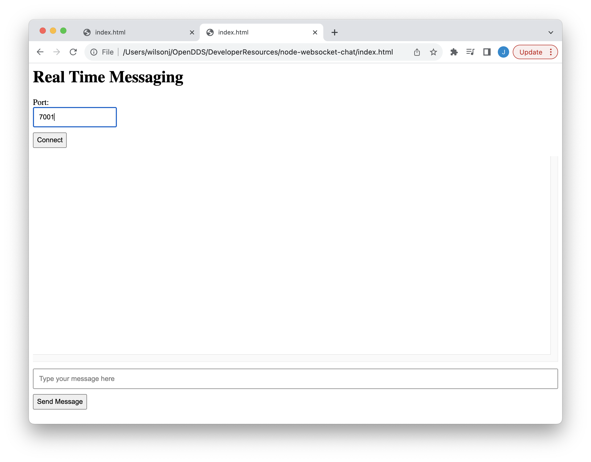
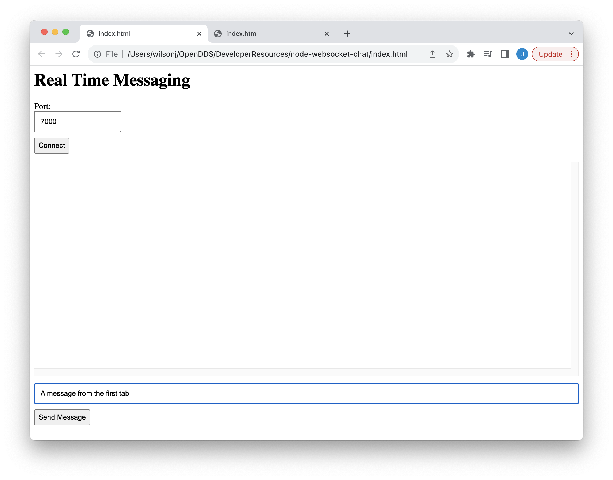
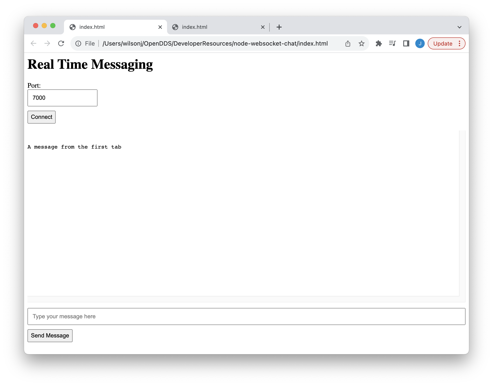
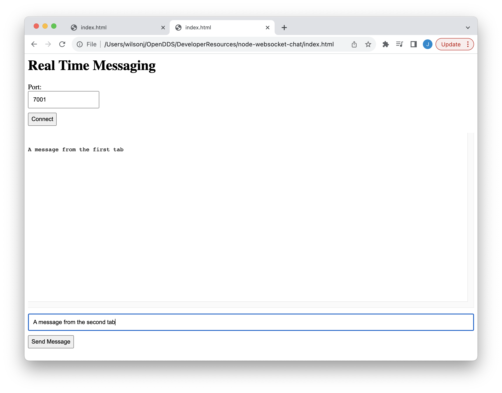
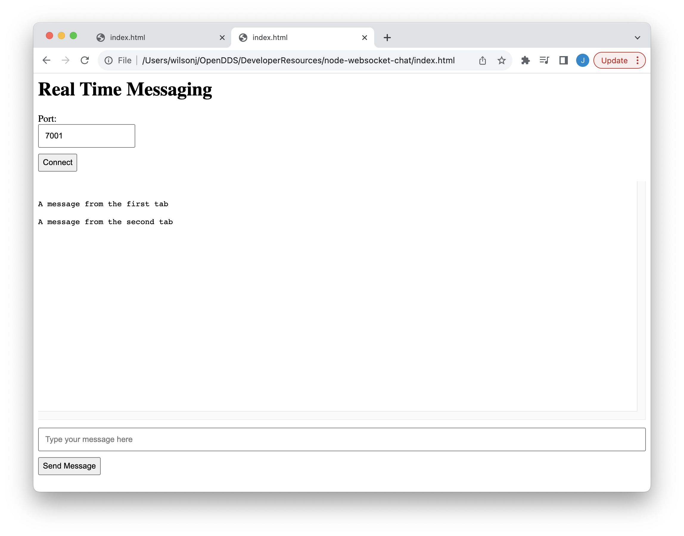
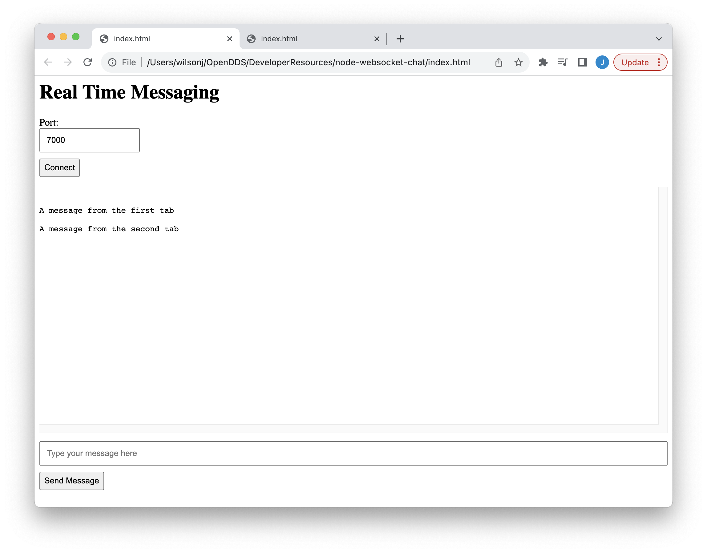

# A Chat Application with Node, OpenDDS, and Websockets

## Introduction

Websockets allow web servers to deliver content to clients without having the client request it and are often used as an alternative to polling.
A client can set up a websocket and listen for events instead of periodically requesting data from the server.
This design can simplify the client and be more efficient as it avoids the constant creation of new TCP connections.

Without websockets, a web server or API can often be made stateless which has a number of benefits including horizontal scalability.
The session created by a websocket means that each instance of a web server is responsible for delivering content to its connected clients.
An event generated in one instance of a webserver may be need to be delivered to clients connected to a different instance.
Thus, websockets create a data distribution problem for the different instances of a webserver.

    +------------+     +------------+
    | Instance 1 |<--->| Instance 2 |
    +------------+     +------------+
           ^                  ^
           |                  |
           v                  v
    +------------+     +------------+
    |   User A   |     |   User B   |
    +------------+     +------------+

Take a simple chat application for example.
Suppose User A is connected to Instance 1 and User B is connected to Instance 2.
When User A sends a message, User B should receive it and vice versa.
This means that Instance 1 needs to be aware of all messages received by Instance 2 and vice versa.
A real chat application would have additional features like multiple rooms/topics, mentions etc.
However, the basic problem remains:  instances need to send messages to other instances.

Logically, the web server instances and their connected clients are part of a publish/subscribe system.
There are a number of ways of implementing publish/subscribe and each approach is a tradeoff between cost, efficiency, complexity, and a number of other concerns.
For example, the instances themselves could just store the events in a database and poll the database for events they need to deliver to their clients.
Using a database in this way may be sub-optimal so it may be necessary to introduce a broker to store-and-forward events among the instances.

Applications like Redis, RabbitMQ, Apache Kafka, and even MQTT implement the necessary functionality while adding yet another service to be deployed.
Cloud vendor provide brokers for a fee; for example, Amazon SNS, Google Cloud Pub/Sub, and Azure Service Bus, Event Hub, and Event Grid.

A broker-less approach would have the instances form a messaging routing network, e.g., a minimum spanning tree, amongst themselves.
This approach favors efficiency and low cost at the expense of complexity.
Some of the complexity can be mitigated by using an application framework or middleware that was designed for publish/subscribe like OpenDDS.
The rest of this article shows how to implement a "websocket backend" with OpenDDS using a simple chat application as an example.

The chat application is based on https://karlhadwen.medium.com/node-js-websocket-tutorial-real-time-chat-room-using-multiple-clients-44a8e26a953e which supports multiple clients but not multiple servers.
The first section describes how the client was extended so the user can specify a server anticipating multiple servers.
The second section describes how the server was extended with OpenDDS so that the servers can communicate with one another.

## Extending the Client

Disclaimer:  I'm not a node programmer; nor am I a UI/UX designer.

To keep things simple, assume that the servers will be hosted on the same machine (localhost).
Thus, the main point of extension is to provide a way that allows the user to configure the port that is used by the server.
To do this, a text entry box was added so the user can specify the port and a button was added that causes the websocket connection to be initialized.
(The websocket is no longer initialized when the page is loaded.)

The other major change to the client is to not show messages when the user clicks the "Send Message" button.
The server was optimized to not send a message back to the client who sent it.
Thus, the client itself was responsible for adding sent messages to the sequence of messages.
This optimization is removed in the new server code so the client will receive every message that it sends.
Consequently, the client just needs to show messages that it receives via the websocket.
The complete client code is [here](index.html).

## Extending the Server

Modifications to the server are based on [this article](https://objectcomputing.com/resources/publications/sett/custom-bridges-between-restful-web-services-and-dds), [this repository](https://github.com/OpenDDS/node-opendds-rest-demo), and the [OpenDDS module for Node.js](https://github.com/OpenDDS/node-opendds).

The first step in extending the server is defining topics for the messages the server instances will exchange.
The name of the topic for this application is `User Messages`.
The data type used for that topic is named `Chat::UserMessage` and is defined in [idl/Chat.idl](idl/Chat.idl).
The `Chat::UserMessage` is a struct containing a single string named `message`.
Both of these names appear in the [chat.js](chat.js) file that will be explained next.
The IDL file compiles to a shared library that will be loaded by the server.

The second step is wrapping OpenDDS in a way that is convenient for the application.
The [chat.js](chat.js) file contains a number of helper methods

* `initializeDds` initializes OpenDDS, loads the IDL shared library, creates a DDS Participant, and creates the DataWriter for user messages.
* `finalizeDds` deletes the participant and finalizes OpenDDS.
* `writer_user_message` writes a `Chat::UserMessage` to the `User Messages` topic.
* `subscribe_user_messages` takes a callback that will be invoked whenever a user message is received.  This code enables reliable data transfer which is off by default for a subscriber.

The [server.js](server.js) file is based on the server code for https://karlhadwen.medium.com/node-js-websocket-tutorial-real-time-chat-room-using-multiple-clients-44a8e26a953e.
The code now contains logic for handling the listening port of the web server so multiple servers can run on the same host and the necessary logic for introducing the OpenDDS wrapper and initializing OpenDDS.

The major change is the code that processes messages received via websocket.
In the original server code, a message that was received on a websocket connect was sent to all of the connection except the one that originally sent the message.
This code has been broken into two separate pieces:  one for receiving and one for sending.
The code that handles messages from the websockets writes the received message to the `User Messages` topic.
When initializing OpenDDS, the code installs a callback that sends a message received on the `User Messages` topic to all of the websocket clients that are connected.
Together, these changes result in the following flow for a message:

1. The client sends a message.
2. The server receives the message via websocket and writes it to the `User Messages` topic.
3. The server receives the message via the `User Messages` topic and writes it to all connected websocket clients.
4. The client receives the message from the websocket and displays it.

Thus, there is two levels of fan-out.
First, a message is distributed to all of the server instances.
Then, it is distributed to all of the clients of a server instance.

## Building and Running

1. [Build OpenDDS](https://opendds.readthedocs.io/en/latest-release/building/index.html).  Let `DDS_ROOT` be the directory containing OpenDDS.

        source "${DDS_ROOT}/setenv.sh"

2. Clone this repo.

        git clone https://github.com/OpenDDS/DeveloperResources.git

3. Enter the directory for this article.

        cd DeveloperResources/node-websocket-chat
    
4. Run mwc.

        mwc.pl -type gnuace
    
5. Run make

        make

6. Export `CHAT_ROOT` for library loading purposes.

        export CHAT_ROOT="${PWD}"

7. Update `LD_LIBRARY_PATH`

        export LD_LIBRARY_PATH="${CHAT_ROOT}/idl"
    
8. Install node modules.

        npm install
    
9. Start the servers in the background 

        node server.js --port 7000 -DCPSConfigFile rtps.ini &
        node server.js --port 7001 -DCPSConfigFile rtps.ini &
    
10. Open `index.html` in a web browser.  Use two tabs or windows to communicate with each server.

    1. In the first tab/window, connect to the first server by using `7000` for the port and clicking "Connect".

       
       
    2. In the second tab/window, connect to the second server by using `7001` for the port and clicking "Connect".

       
       
    3. In the first tab/window, type a message.

       
       
    4. In the first tab/window, click the "Send Message".

       
       

       Check the output from the server.
       It should be something like
       
            Writing message {"message":"A message from the first tab"}
            Received a message {"message":"A message from the first tab"}
            Received a message {"message":"A message from the first tab"}
       
    5. Switch to the second tab/window to see that it also received the message.

       
       
    6. In the second tab/window, type a message.

       
       
    7. In the second tab/window, click the "Send Message".

       
       
    8. Switch to the first tab/window to see that it also received the message.

       

## Conclusion

Websockets allow clients and servers to efficiently and dynamically exchange messages but create a data distribution problem when multiple server instances are used.
This article explores the idea of using OpenDDS to distribute data between web server instances using websockets.
Specifically, the article extends a chat application using OpenDDS with RTPS Discovery so that multiple servers can be used without additional infrastructure.
The promise of "without additional infrastructure" is a bit misleading since many cloud-based environments don't meet the prerequisites for RTPS Discovery as described [here](https://objectcomputing.com/resources/publications/sett/march-2019-multicast-to-cloud-for-dds-applications) and [here](https://objectcomputing.com/resources/publications/mnb/2019/06/20/interoperable-internet-enabled-dds-applications).

The server developed in this article could be extended in a number of ways.
For example, events generated by clients could be delivered to more than just other server instances.
Similarly, other systems could deliver events to the server instances for distribution to clients.
One advantage that DDS and OpenDDS have over other solutions in this space is the ability to control the distribution of data with Quality of Service settings and features like content filtering.

## Questions and Comments

Improvements to this article are welcome.
Just submit a [pull request](https://github.com/OpenDDS/DeveloperResources/pulls).
If you have questions and comments, please use [this discussion board](https://github.com/OpenDDS/DeveloperResources/discussions/categories/q-a).
